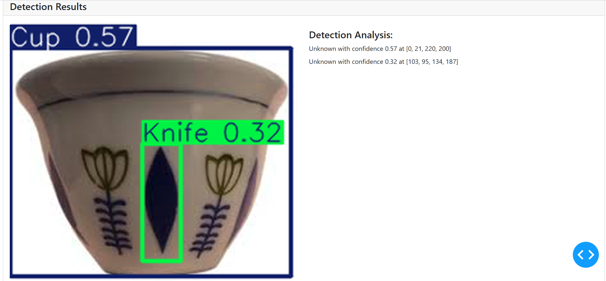

# YOLO Object Detection Dashboard


<div style="display: flex; justify-content: space-between;">
  
  

</div>
<div style="display: flex; justify-content: space-between;">
  
  

</div>

## Overview

This project implements an object detection pipeline using the YOLO model, trained on a custom dataset collected from household environments, specifically focusing on coffee-related equipment such as water bottles, spoons, porcelain, coffee tables, cups, plates, mobile phones, kettles, knives, pots, coffee pots, and buckets.

The application includes a web-based dashboard built with Dash and Dash Bootstrap Components (DBC), allowing users to upload images, process them through the trained YOLO model, and display detection results along with confidence scores.

## Features

- Automatic dataset splitting into training and validation sets.
- YOLO model training and inference.
- Web-based user interface for uploading images and displaying detection results.
- Bounding box visualization with detection labels and confidence scores.

---

## Installation

### Prerequisites

Ensure you have the following installed:

- Python 3.7+
- pip

### Clone the Repository

```bash
git clone https://github.com/Tsegaye16/Yolo-project
cd Yolo-project
```

### Install Dependencies

```bash
pip install -r requirements.txt
```

---

## Dataset Preparation

### Unzip Dataset

```bash
unzip -q data.zip -d custom_data
```

### Dataset Splitting

Use the Training_YOLO model_building.ipynb notebook to train the YOLO model.

### Verify Data Configuration

```bash
cat data.yaml
```

---

## Training the YOLO Model

### Install YOLOv8

```bash
pip install ultralytics
```

### Train the Model

```bash
yolo train model=yolov8n.pt data=data.yaml epochs=50 imgsz=640
```

---

## Running the Dashboard

Start the Dash application:

```bash
python app.py
```

The web app will be available at:

```
http://127.0.0.1:8050/
```

---

## Usage

1. Open the web application.
2. Upload an image using the provided UI.
3. View the detected objects along with their confidence scores.

---

## Troubleshooting

### Common Issues & Fixes

- **YOLO ImportError:** Ensure `ultralytics` is installed with `pip install ultralytics`.
- **Invalid Image Format:** Convert images to PNG/JPG before uploading.
- **App Not Running:** Check if port 8050 is free or specify another port: `python app.py --port 8080`.

---
